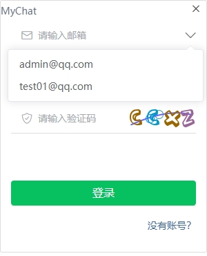
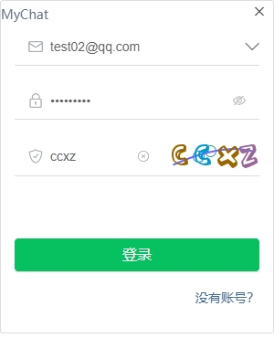
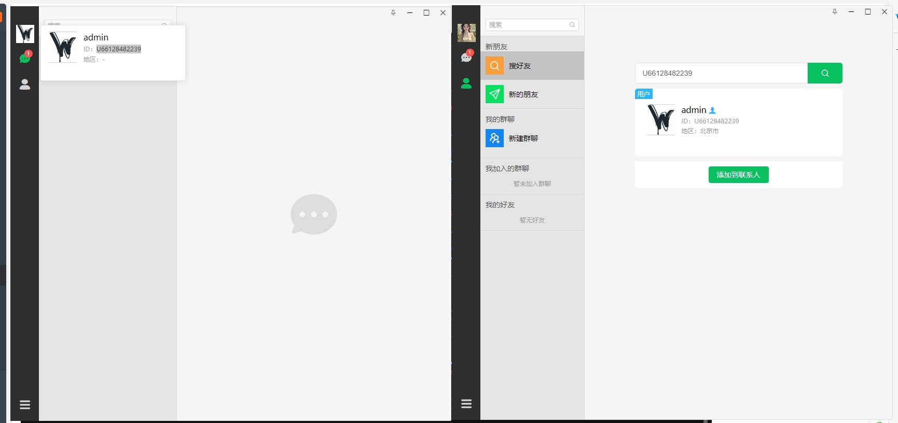
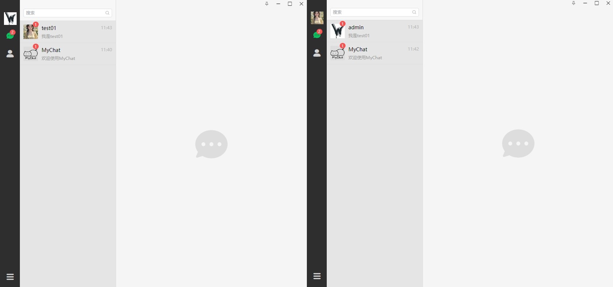
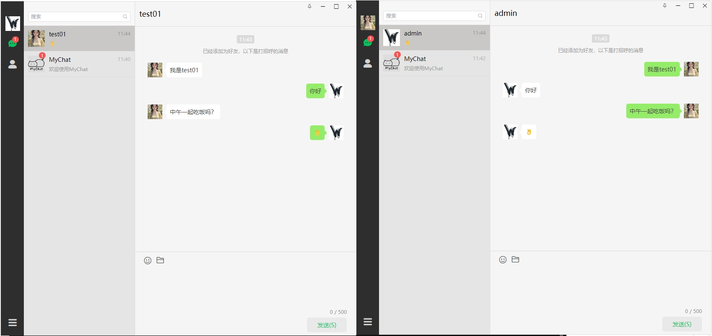
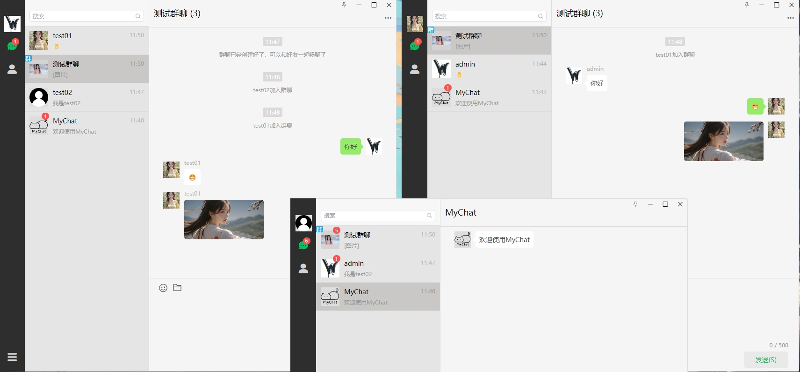
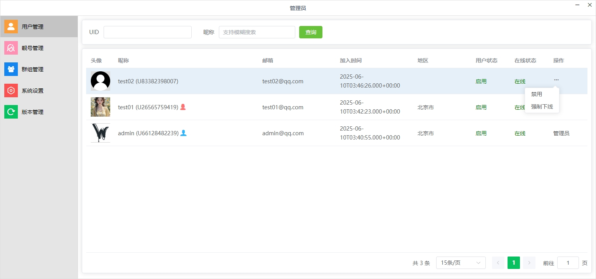

# MyChat-仿微信实时聊天通信项目-客户端


MyChat是一个基于Java技术栈的仿微信实时聊天通信系统，提供单聊、群聊、消息推送、媒体文件发送下载查看等核心功能。

- **服务端**: [MyChat-Service](https://github.com/SoulGoodman-coder/MyChat-Server) (Java/Springboot实现)

## 技术栈
| 技术         | 用途         | 版本    |
| ------------ | ------------ | ------- |
| Node.js      | 运行时       | 16.20.0 |
| Electron     | 桌面应用框架 | ^25.6.0 |
| Vue 3        | 前端框架     | ^3.3.4  |
| SQLite3      | 本地数据库   | ^5.1.7  |
| ws           | 实时通信     | ^8.16.0 |
| element-plus | 页面UI       | ^2.4.3  |

## 功能特性

### 核心功能
- 用户注册/登录/个人信息管理
- 好友关系管理（添加/删除/查找）
- 单聊消息实时收发
- 群组创建/管理
- 群聊消息广播
- 消息已读未读状态
- 历史消息查询
- 媒体文件发送下载查看

### 高级特性
- 心跳检测保持长连接

- 离线消息存储

- WebSocket协议支持

## 快速启动

### 环境准备
```bash
# 必须使用 Node 16.20
nvm install 16.20.0
nvm use 16.20.0
# 下载 ffmpeg.exe 和 ffprobe.exe 放到项目根目录/assets目录下
https://www.gyan.dev/ffmpeg/builds/ffmpeg-git-full.7z
```

### 安装依赖

```
cnpm install
```

### 开发模式

```
npm run dev
```

### 生产构建

```
npm run build:win
npm run build:mac
npm run build:linux
```

## 项目截图













## 开源协议

GNU General Public License v3.0 (GPLv3)

本项目采用 **GPLv3** 许可证，您必须遵守以下条款：

1. 任何衍生作品必须**保持相同许可证**
2. 必须公开修改后的**完整源代码**
3. 需明确标注**原始版权声明**
